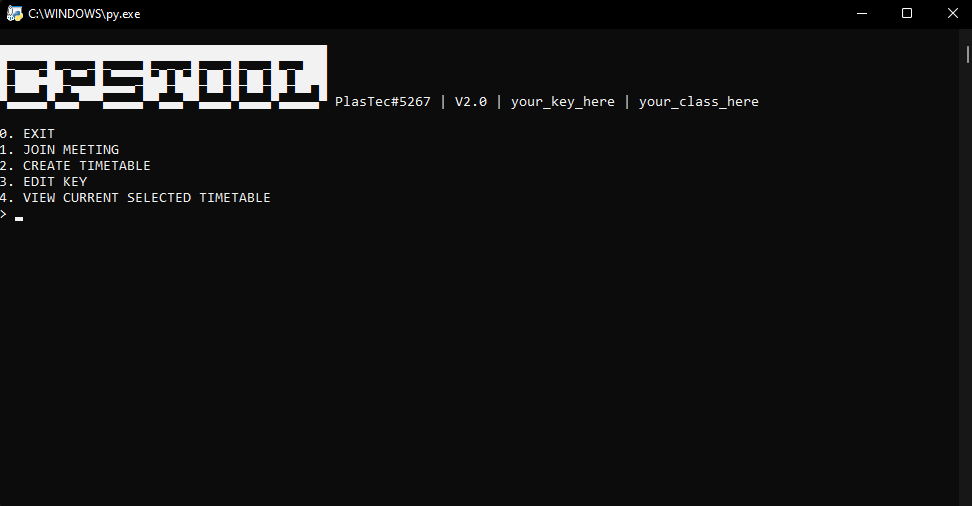

# CPSTOOL

CPSTOOL is a tool designed to help the user manage his online zoom links and share them between friends.

## SCREENSHOT


## Features of CPSTOOL
* MANAGE TIMETABLES AND ZOOM LINKS
* CREATE TIMETABLES AND ZOOM LINKS
* SHARE TIMETABLES AND ZOOM LINKS USING A KEY
* LIGHT WIEGHT


## Prerequisites
```
pip install pyperclip==1.8.2
```
```
pip install requests==2.26.0
```
```
pip install tabulate==0.8.9
```

## Installation
```
pip install -r requirements.txt
```
